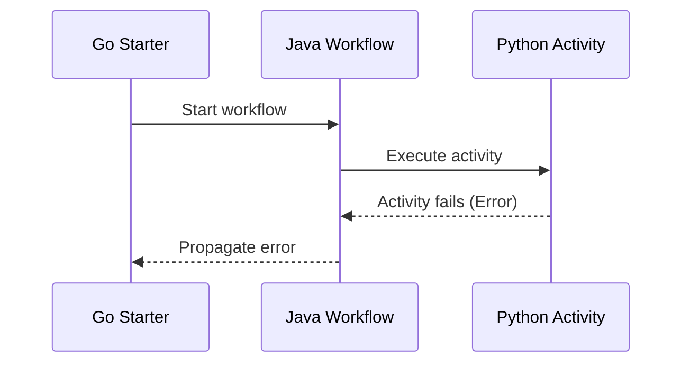

# Cross-Language Error Propagation Demo

This demo demonstrates Temporal's ability to preserve stack traces across
process and SDK language boundaries. Temporal uses a single Protobuf to represent
failures, which simplifies the process of preserving stack traces across process
and SDK language boundaries.

**Note: Running this demo will require you to have Python, Java, and Go installed
on your machine. These are already provided in the GitPod environment**

```bash
temporal server start-dev --ui-port 8080 --db-filename clusterdata.db
```

## Demo Explanation

This code demonstrates the propagation of errors across language and process
boundaries. A Go program requests the execution of a Java Workflow that calls
an Activity in Python to compose a greeting. This greeting purposefully fails,
and the error messages are propagated back up to the starter, preserving the
stack traces and adding breadcrumbs so you can see the path it took.

Below is a diagram of how this process works:



**Before running the below code, ensure you have a Temporal Service running**

## Run the Python Activity

1. Change into the `activity` directory
2. Create a virtual environment and activate it
```bash
python -m venv venv
source venv/bin/activate
```
3. Install the required Python packages
```bash
pip install -r requirements.txt
```
4. Run the Worker
```bash
python worker.py
```

## Run the Java Workflow

1. Change directories into the `workflow` directory.
2. Compile the Java Workflow.
```bash
mvn clean compile
```
3. Run the Worker using `mvn`
```bash
mvn exec:java -Dexec.mainClass="greetingworkflow.GreetingWorker"
```

## Run the Go Starter

1. Change directories into the `starter` directory.
2. Install the Go SDK
```bash
go get
```
3. Run the Starter
```bash
go run main.go
```

## Observing the Results

1. Review the stack trace in the terminal that runs the Python Worker. It should
only show the Python code.
2. Review the stack trace in the terminal window that runs the Java Worker. You 
should see the stack trace from the Python Activity in the Java stack trace.
3. Observe the stack trace in the terminal window that runs Starter code. Note 
that it shows the messages from the failures from both the Java Workflow and 
Python Activity.
4. Go to the Web UI and click into the Workflow Execution named `errors-demo`.
Scroll down and view the Event History and expand on the Failed events. You
should see the stack traces within the history. In the final error, you will
see the propagated errors from the Python Activity in the Java Workflow stack trace.
This stack trace will be similar to what you observed in the Java Workflow Terminal
stack trace.
